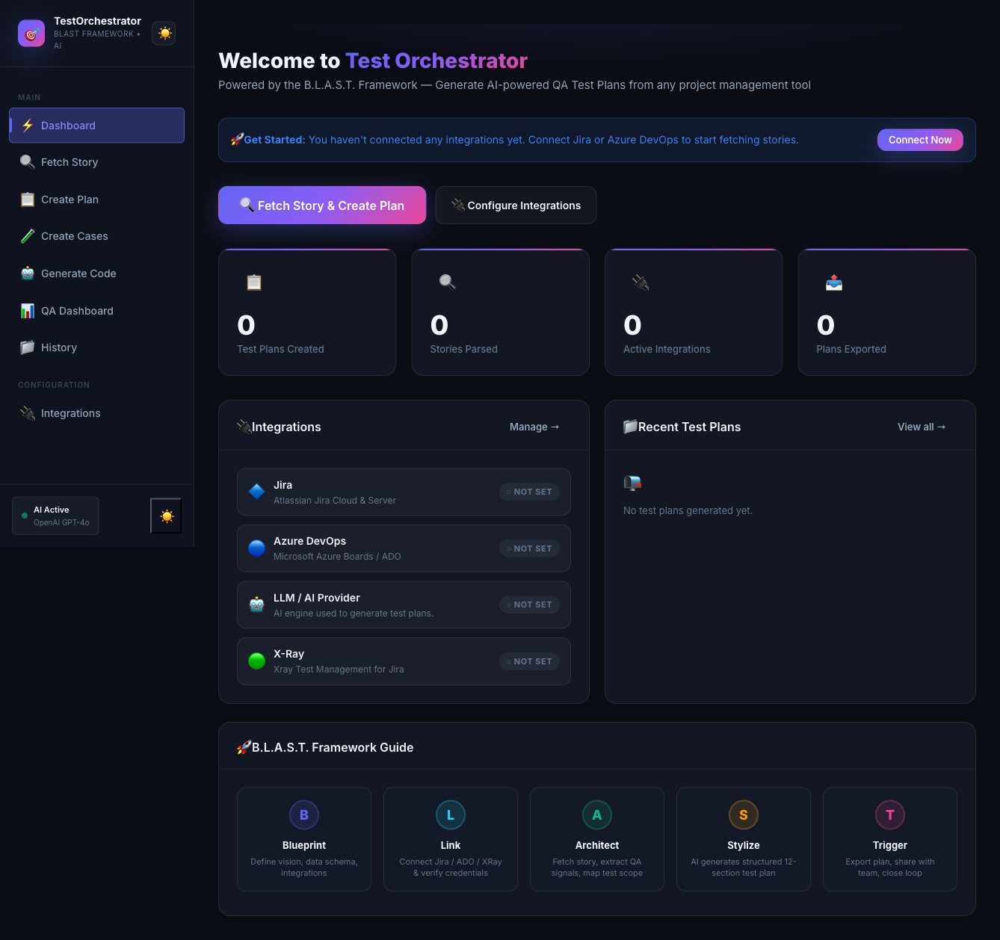
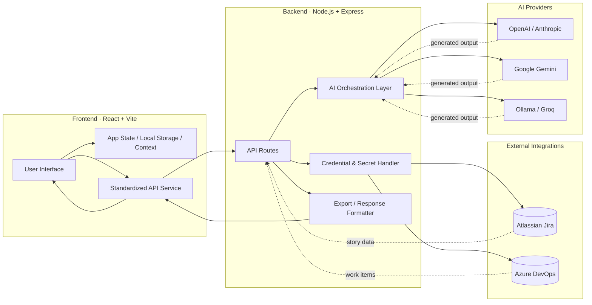

# AI Test Orchestrator



> Generate professional QA Test Plans, Test Cases, and Automation Code from Jira, Azure DevOps & XRay stories — powered by the **B.L.A.S.T. Framework** and AI.

## ✨ Features

- 🔌 **Multi-platform Connectors**: Native support for Atlassian Jira and Microsoft Azure DevOps.
- 🤖 **Advanced AI Engine**: Supports OpenAI (GPT-4o), Anthropic (Claude 3.5), Gemini, Groq, Ollama, and custom OpenAI-compatible endpoints.
- 📋 **B.L.A.S.T. Test Plans**: Generates enterprise-grade, 12-section structured test plans.
- 🧪 **Smart Test Case Generator**: Creates detailed positive, negative, and boundary test cases with step-by-step instructions and expected results.
- 📊 **QA Dashboard & Analytics**: Actionable insights into test coverage, priority distribution, and quality flags (e.g., detecting low-quality expected results).
- 🤖 **Automation Code Generator**: Converts manual test cases into production-ready Playwright or Selenium (Java) code, preserving story/epic context.
- 🎨 **Modern UX**: Premium dark/light theme with glassmorphism, real-time connection testing, and secure credential management.
- 📁 **History & Export**: Persistent history of generated plans and easy export to Markdown or JSON.
- 🚀 **Vercel-ready**: Optimized for modern cloud deployments.

## 🚀 Quick Start

```bash
# 1. Install dependencies
npm install

# 2. Configure environment
cp .env.example .env
# Edit .env with your API keys (optional, can also be configured in UI)

# 3. Run development server
npm run dev
# Frontend: http://localhost:5173
# Backend API: http://localhost:3001
```

## 🔧 Configuration

The application allows you to configure your integrations either via `.env` file or directly through the **Integrations** page in the UI. 

### Environment Variables

| Variable | Required | Description |
|----------|----------|-------------|
| `LLM_PROVIDER` | Yes | `openai`, `anthropic`, `ollama`, `groq`, `gemini`, or `custom` |
| `OPENAI_API_KEY` | If OpenAI | Your OpenAI API key |
| `ANTHROPIC_API_KEY` | If Anthropic | Your Claude API key |
| `GROQ_API_KEY` | If Groq | Your Groq API key |
| `GEMINI_API_KEY` | If Gemini | Your Google Gemini API key |

> 💡 **Tip**: Credentials entered in the UI are stored securely in your browser's `localStorage` and are used for the current session.

## 🏗️ B.L.A.S.T. Framework

The AI Test Orchestrator is built on the **B.L.A.S.T.** framework for consistent QA output:

| Letter | Phase | What happens |
|--------|-------|--------------|
| **B** | Blueprint | Story normalization and validation |
| **L** | Link | Secure integration with project management tools |
| **A** | Architect | Extraction of QA signals (Priority, AC, Flags) |
| **S** | Stylize | AI generation of structured plans and cases |
| **T** | Trigger | Automated code generation and exports |

## 🧩 System Architecture



## 🌐 Deploy to Vercel

```bash
npx vercel --prod
```

Ensure you set the required environment variables in the Vercel project settings.

## 📋 Generated Output

### Test Plan Sections
1. Objective | 2. Scope | 3. Inclusions | 4. Test Environments | 5. Defect Reporting
6. Test Strategy | 7. Test Schedule | 8. Deliverables | 9. Entry/Exit Criteria
10. Tools | 11. Risks & Mitigations | 12. Approvals

### Test Cases
- Imperative, numbered steps
- Observable expected results
- Automated Traceability Matrix
- Coverage analytics and gap detection
