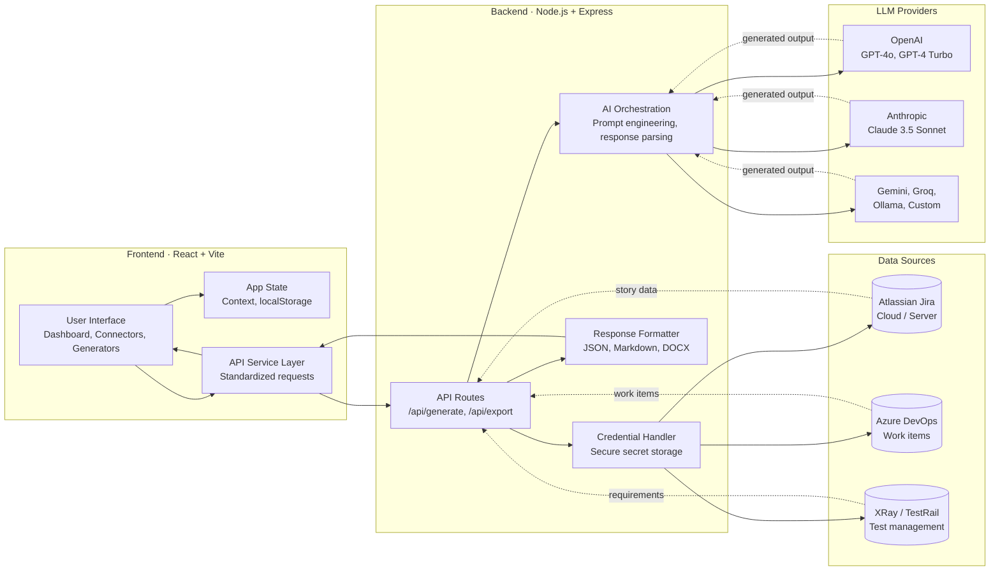

# AI Test Orchestrator

[](https://vercel.com)
[](LICENSE)
[](https://nodejs.org)
[](https://react.dev)
[](https://www.w3.org/WAI/WCAG21/quickref/)

> **Transform QA workflows**: Generate professional test plans, test cases, and automation code from Jira/Azure DevOps—powered by the **B.L.A.S.T. Framework** and AI. No manual spreadsheets. No context switching. Just structured, exportable QA artifacts.
---

## 🎯 Why This Project Exists

**The Problem:**
QA teams waste hours on repetitive, fragmented work:
- 📌 Context switching between Jira/ADO, email, and spreadsheets
- ✍️ Manually writing test plans and test cases from scratch
- 🔄 Duplicating effort: copying manual cases into automation frameworks
- 📊 No traceability between stories, cases, and automation
- ⏱️ Exporting results for audits requires manual compilation

**The Solution:**
AI Test Orchestrator eliminates toil by automating the entire QA pipeline—from story ingestion to exportable test artifacts. It uses the **B.L.A.S.T. framework** to normalize QA logic, ensuring consistent, professional output every time.

---

## ✨ Key Features

- 🔌 **Multi-platform Connectors**: Native Jira, Azure DevOps, and XRay integration
- 🤖 **Flexible AI Engine**: OpenAI, Anthropic, Gemini, Groq, Ollama, or custom endpoints
- 📋 **B.L.A.S.T. Test Plans**: Enterprise-grade 12-section structured plans
- 🧪 **Smart Test Case Generator**: Positive, negative, boundary cases with expected results
- 📊 **Analytics Dashboard**: Test coverage, risk matrices, quality flags
- 🤖 **Automation Code Generation**: Playwright / Selenium code from test cases
- 📁 **History & Export**: Persistent results, Markdown/JSON/DOCX export
- ♿ **WCAG 2.1 AA Accessible**: Keyboard navigation, 4.5:1 contrast, screen reader compatible
- 🎨 **Premium UX**: Dark/light theme, glassmorphism, real-time validation
- 🚀 **Vercel-ready**: Deploy in one click

---

## 🔄 How It Works

```
1. 🔌 Connect → Authenticate Jira / Azure DevOps / XRay
   └─ Secure credential handling via UI or .env

2. 📖 Fetch → Pull stories, epics, and requirements
   └─ Auto-detect acceptance criteria and user context

3. 🏗️ Normalize → B.L.A.S.T. processes raw story data
   └─ Extract priority, flags, platform, and environment

4. ✨ Generate → AI creates test plans, cases, and automation code
   └─ Structured templates + contextual prompt injection

5. 📊 Analyze → QA Dashboard shows coverage gaps and risk areas
   └─ Automated traceability matrix

6. 📤 Export → Download as Markdown, JSON, DOCX, or share via URL
   └─ Audit-ready, traceable artifacts
```

---

## 🏗️ Architecture

The system separates concerns into a deterministic pipeline:



---

## 🛠️ Tech Stack

**Frontend**
- React 18.3 + Vite 5.2
- TailwindCSS-inspired custom CSS (glassmorphism)
- Vitest for testing

**Backend**
- Node.js 18+
- Express.js 4.18
- Marked for Markdown parsing

**Integrations**
- Jira REST API v3
- Azure DevOps REST API
- XRay cloud API

**LLM Providers**
- OpenAI (GPT-4o, GPT-4 Turbo)
- Anthropic (Claude 3.5 Sonnet)
- Google Gemini
- Groq
- Ollama (local)
- Custom OpenAI-compatible endpoints

**Deployment**
- Vercel serverless functions
- GitHub for version control

---

## 📁 Folder Structure

```
.
├── src/                          # Frontend React application
│   ├── pages/                    # Page components (Dashboard, Connectors, etc.)
│   │   ├── Dashboard.jsx         # Main dashboard with BLAST framework info
│   │   ├── DashboardAnalytics.jsx # QA analytics and coverage metrics
│   │   ├── StoryFetcher.jsx      # Jira/ADO story ingestion
│   │   ├── TestPlanCreator.jsx   # Test plan generation
│   │   ├── TestCaseCreator.jsx   # Test case generation
│   │   ├── CodeGenerator.jsx     # Automation code generation
│   │   ├── Connectors.jsx        # Integration configuration
│   │   └── History.jsx           # View/export past results
│   ├── components/               # Reusable UI components
│   │   ├── StoryCard.jsx         # Story display component
│   │   └── Toast.jsx             # Toast notifications
│   ├── layouts/                  # App layout wrapper
│   ├── services/                 # API client
│   ├── context/                  # React Context for global state
│   ├── hooks/                    # Custom React hooks
│   ├── utils/                    # Utilities (mockData, formatters)
│   └── index.css                 # Global styles + design system
│
├── api/                          # Backend Express server
│   ├── server.js                 # Entry point
│   ├── routes/                   # API endpoints
│   │   ├── generate.js           # Test plan/case/code generation
│   │   ├── jira.js               # Jira connector
│   │   ├── ado.js                # Azure DevOps connector
│   │   ├── export.js             # Export formatters (Markdown, DOCX, JSON)
│   │   └── connections.js        # Integration management
│   ├── services/                 # Business logic
│   │   └── aiOrchestrator.js     # LLM integration layer
│   └── utils/                    # Helpers (credential handler, response formatter)
│
├── tests/                        # Test suite
│   ├── api.test.js               # Backend API tests
│   ├── App.test.jsx              # Frontend component tests
│   └── setup.js                  # Test configuration
│
├── BLAST/                        # B.L.A.S.T. framework documentation
│   └── blast.md                  # Protocol, phases, and principles
│
├── vite.config.js                # Vite bundler config
├── vitest.config.js              # Vitest test runner config
├── package.json                  # Dependencies and scripts
├── .env.example                  # Environment variable template
├── LICENSE                       # MIT License
└── README.md                     # This file
```

---

## 🚀 Quick Start

```bash
# 1. Clone and install
git clone https://github.com/yourusername/ai-test-orchestrator.git
cd ai-test-orchestrator
npm install

# 2. Configure environment
cp .env.example .env
# Edit .env with your API keys (optional, can also use UI)

# 3. Run development server
npm run dev
# Frontend: http://localhost:5173
# Backend: http://localhost:3001

# 4. Open dashboard
# Visit http://localhost:5173
# Go to Integrations tab to connect Jira/ADO
```


## 🔧 Configuration

### Environment Variables

| Variable | Required | Example |
|----------|----------|---------|
| `OPENAI_API_KEY` | If using OpenAI | `sk-...` |
| `ANTHROPIC_API_KEY` | If using Anthropic | `sk-ant-...` |
| `GROQ_API_KEY` | If using Groq | `gsk_...` |
| `GEMINI_API_KEY` | If using Gemini | `AIza...` |
| `JIRA_DOMAIN` | Optional | `your-domain.atlassian.net` |
| `JIRA_EMAIL` | Optional | `user@company.com` |
| `JIRA_API_TOKEN` | Optional | `ATAT...` |
| `ADO_ORGANIZATION` | Optional | `your-org` |
| `ADO_PAT` | Optional | `PAT...` |

**💡 Tip**: All credentials can be configured in the **Integrations** page. UI settings override `.env` values.

---

## 📊 Example Outputs

### Generated Test Plan (JSON)
```json
{
  "story": { "id": "PROJ-123", "title": "User login" },
  "testPlan": {
    "objective": "Verify secure authentication...",
    "scope": "Web and mobile platforms",
    "inclusions": ["Valid credentials", "Invalid credentials", "MFA"],
    "testEnvironments": ["QA", "Staging", "Production"],
    "testStrategy": "Functional + Security testing",
    "estimatedDuration": "5 days",
    "risks": ["MFA delays", "Third-party API downtime"],
    "approvals": ["QA Lead", "Product Owner"]
  }
}
```

### Generated Test Cases
```json
{
  "cases": [
    {
      "id": "TC-001",
      "title": "Valid login with correct credentials",
      "steps": [
        { "step": 1, "action": "Navigate to login page", "expected": "Login form displayed" },
        { "step": 2, "action": "Enter valid email and password", "expected": "Form accepts input" },
        { "step": 3, "action": "Click login button", "expected": "User redirected to dashboard" }
      ],
      "priority": "P0",
      "type": "Functional"
    }
  ]
}
```

### Generated Automation Code (Playwright)
```javascript
import { test, expect } from '@playwright/test';

test('Valid login with correct credentials', async ({ page }) => {
  await page.goto('https://app.example.com/login');
  await page.fill('input[name="email"]', 'user@example.com');
  await page.fill('input[name="password"]', 'SecurePassword123!');
  await page.click('button:has-text("Login")');
  await expect(page).toHaveURL('https://app.example.com/dashboard');
});
```

### Analytics Output
```json
{
  "totalTestCases": 45,
  "coverage": {
    "positive": 25,
    "negative": 15,
    "boundary": 5
  },
  "priorities": { "P0": 10, "P1": 20, "P2": 15 },
  "riskFlags": [
    "Low expected result quality in 3 cases",
    "Missing edge cases for payment flow"
  ]
}
```

---

## 🌐 Use Cases

| User | Goal | Benefit |
|------|------|---------|
| **QA Lead** | Prepare sprint test plans | Cut planning time by 80%, ensure consistency |
| **Manual QA Engineer** | Generate structured test cases | Reduce case writing by 70%, improve clarity |
| **Automation Engineer** | Convert cases to Selenium/Playwright | Skip manual transcription, focus on complex logic |
| **Compliance Officer** | Export audit-ready artifacts | Traceable, signed QA records |
| **DevOps / CI Team** | Integrate test generation into pipelines | Auto-generate test suites on PR creation |

---

## ♿ Accessibility & Design

The application is **WCAG 2.1 AA compliant** with:

✅ **Keyboard Navigation**
- Tab through all interactive elements with visible focus indicators (cyan outline)
- Sidebar active state clearly indicated
- Form fields show glow on focus

✅ **Contrast Ratios**
- All text meets 4.5:1 minimum (WCAG AA standard)
- Integration status labels: 5.5:1
- Primary buttons: text-shadow for robustness on gradients

✅ **Screen Reader Support**
- Proper semantic HTML with heading hierarchy
- ARIA attributes: `aria-expanded`, `aria-label`, `aria-level`
- Compatible with NVDA, VoiceOver, JAWS

✅ **Design System**
- Icon standardization (`.icon-circle` utility)
- Premium glassmorphism aesthetic
- Dark/light theme support
- Progressive disclosure (collapsible BLAST framework saves ~40% mobile height)
- 24px spacing grid for consistency

---

## 🌐 Deployment

### Deploy to Vercel (Recommended)

```bash
npm install -g vercel
vercel --prod
```

Set environment variables in Vercel dashboard:
- Go to Settings → Environment Variables
- Add `OPENAI_API_KEY`, `ANTHROPIC_API_KEY`, etc.

### Deploy to Docker

```bash
docker build -t ai-test-orchestrator .
docker run -p 5173:5173 -p 3001:3001 ai-test-orchestrator
```

### Self-Hosted

```bash
npm run build
npm start
```

---

## 🛣️ Roadmap

**v2.0 (Q2 2026)**
- [ ] XRay direct connector (avoid manual sync)
- [ ] Rich analytics dashboards with charts
- [ ] Prompt templates library (customizable generation)
- [ ] Team collaboration (shared plans, comments)
- [ ] PDF/HTML report generation

**v2.5 (Q3 2026)**
- [ ] CI/CD integration (GitHub Actions, GitLab CI)
- [ ] Slack notifications on plan generation
- [ ] Test case version control (git-backed)
- [ ] LLM cost tracking and optimization

**v3.0 (Q4 2026)**
- [ ] Multi-language test case generation
- [ ] Advanced analytics (trend analysis, defect correlation)
- [ ] AI-powered test maintenance (auto-update broken cases)
- [ ] Enterprise SSO + RBAC

---

## 📝 License

This project is licensed under the **MIT License** — see [LICENSE](LICENSE) for details.

---

## 🤝 Contributing

Contributions are welcome! Please:

1. Fork the repository
2. Create a feature branch (`git checkout -b feature/your-feature`)
3. Commit changes (`git commit -m 'feat: add your feature'`)
4. Push to branch (`git push origin feature/your-feature`)
5. Open a Pull Request

---

## 💬 Support

- **Documentation**: See [CODE_GENERATOR_GUIDE.md](CODE_GENERATOR_GUIDE.md)
- **Issues**: [GitHub Issues](https://github.com/yourusername/ai-test-orchestrator/issues)
- **Discussions**: [GitHub Discussions](https://github.com/yourusername/ai-test-orchestrator/discussions)

---

## 📖 Learn More

- [B.L.A.S.T. Framework Documentation](BLAST/blast.md)
- [OpenAI API Docs](https://platform.openai.com/docs)
- [Jira REST API](https://developer.atlassian.com/cloud/jira/rest)
- [Azure DevOps API](https://learn.microsoft.com/en-us/azure/devops/integrate/concepts/rest-api-overview)

---

**Made with ❤️ by the QA Automation community**
